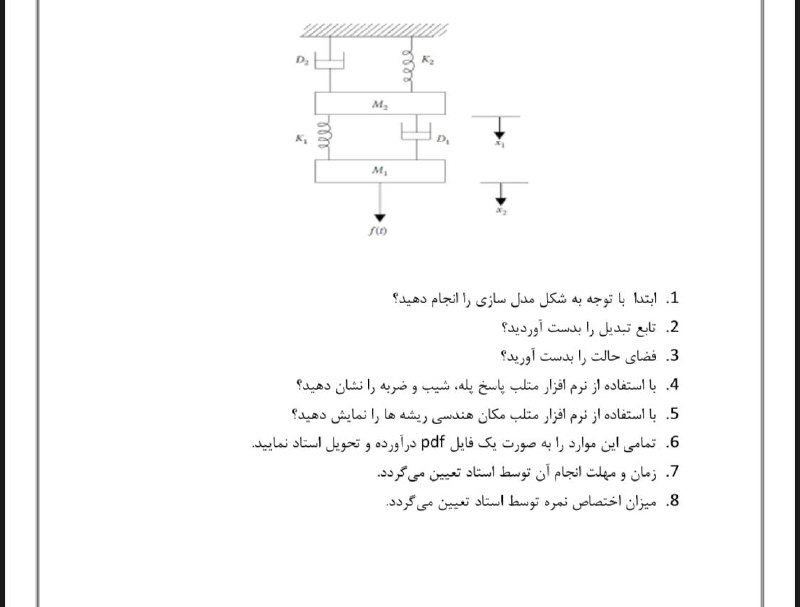

# Control System Analysis 
    on a sample mechanical system
* MatLab + Python

* Note: Python script is not completed yet.

* Features:
* Solve State Space Equation by ode45 algorythom
* Obatain TransferFunction through state space matrices,
    using two separate spproaches
* Step by step Solving
* Implementing main curves of the system such as: 
    1- StateSpace Position/Velocity plot
    2- Step Response Plot
    3- Impulse Response plot
    4- Ramp plot
    5- Root Locus Plot.

* Program has full input gathering alongside providing default values.

: System in question :
